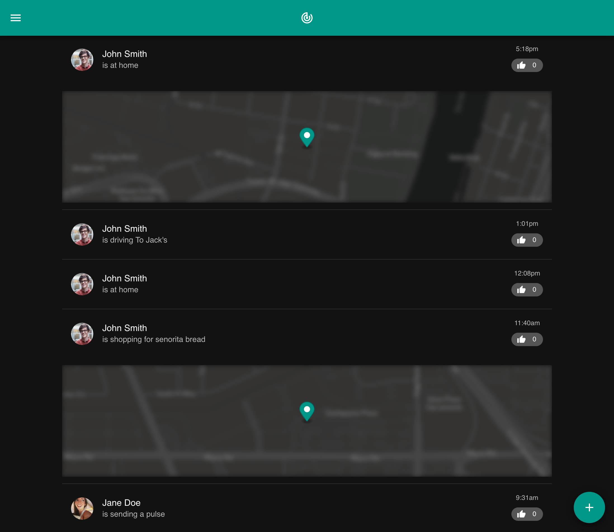
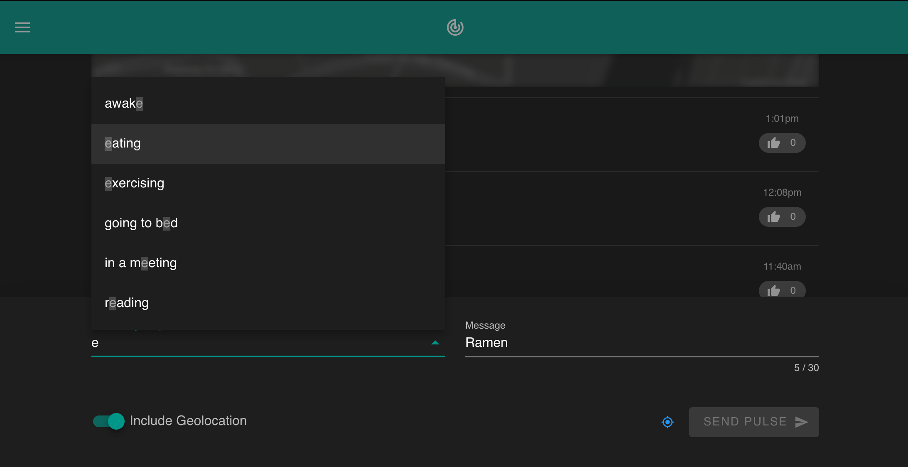

[](https://app.netlify.com/sites/luis-pulse/deploys)


 

###### Please consider supporting my work and other projects:

[](https://offset.earth/luisaugusto)
[](https://www.buymeacoffee.com/luiscodes)

# Pulse

Pulse is a PWA that can be used to send brief status messages between other users.



I built this as a tool for my wife and I so that we could send each other pings to stay updated while we are not together. Creating a pulse is as simple as clicking the plus button at the bottom.



I also used this as an opportunity to learn how to connect Firebase to a Vue application as well as to understand and utilize progressive web app features.

## Features

- 🌙 Dark Mode
- 📍 [Geolocation API](https://developer.mozilla.org/en-US/docs/Web/API/Geolocation_API) and [Mapbox](https://www.mapbox.com/) Rendering
- 🔥 [Firebase Authentication](https://firebase.google.com/products/auth/) and [Firestore Database Integration](https://cloud.google.com/firestore/)
- ❗️ *Push Notifications (Coming Soon)*
- 👨‍👩‍👧‍👦 *Add and share pulses with friends (Coming Soon)*

## Built With Vue

- [Vue CLI](https://cli.vuejs.org/)
- [VuexFire](https://vuefire.vuejs.org/vuexfire/)
- [Vuetify](https://vuetifyjs.com/en/)

## Developer Notes

### Installation

Clone the repository to your computer and install dependencies.

```
$ git clone git@github.com:luisaugusto/pulse.git
$ cd pulse

$ npm install
```

### Usage

Compiles and hot-reloads for development:

```
npm run serve
```

Lints and fixes files:

```
npm run lint
```

For Building the Application:

```
npm run build
```

### Setting Up Firebase and Mapbox

I have special rules in place so that only my wife and I can access the data, so if you like to test the application locally, you will need to create a new Firestore database and replace the property values in [`/src/firebase.js`](/src/firebase.js).

The Mapbox API also has a restricted public key which only allows access on `localhost` and my Netlify deploy URL. If you would like to deploy your own application, you will need to create your own Mapbox account and API key and add it to the [`PulseMap.vue`](/src/components/PulseMap.vue#L75) file.

## Contributing

Pull requests are welcome. For major changes, please open an issue first to discuss what you would like to change.

To make a contribution, you can follow these steps:

1. Fork the repository to your account and clone your forked copy.
2. Create a new branch and make any changes on that branch.
3. Create a pull request using that branch onto my master branch. If the changes are to resolve an issue, please reference the issue number in the pull request.

